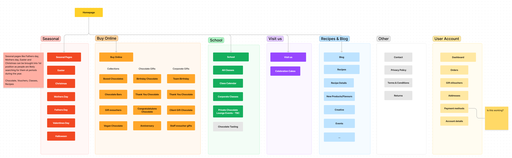
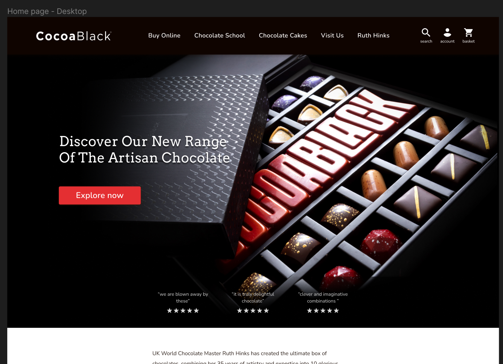
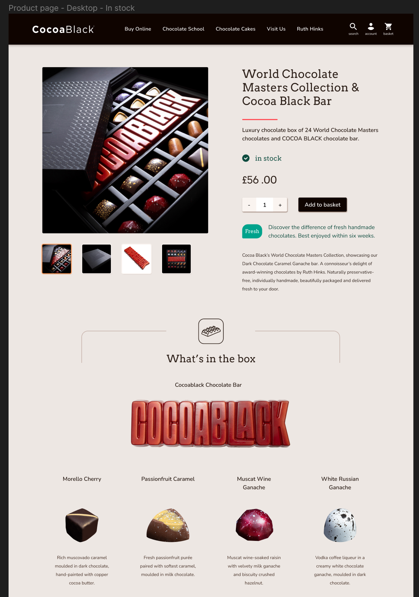
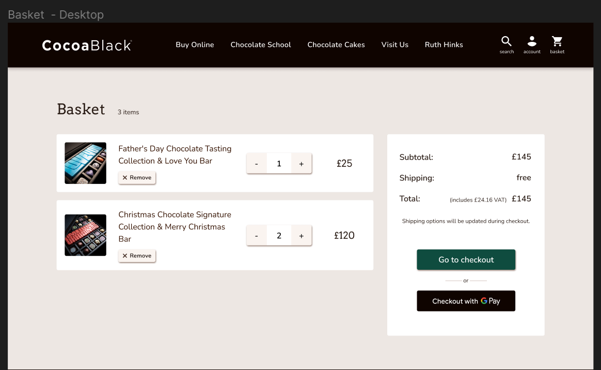
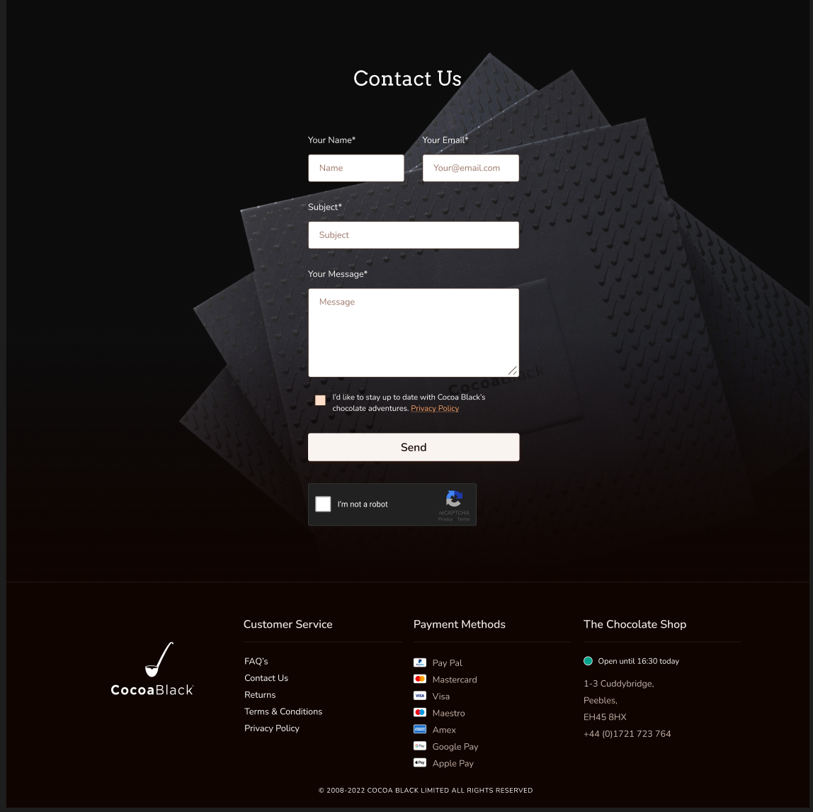

> **CLIENT:** Cocoablack. (Artisan Chocolatier)  
**MY ROLE:** Lead UX/UI Designer 
**TOOLS:** Figma, FigJam, Google Forms 
**DURATION:** 12 weeks

**PROJECT GOAL:**   

Increase online sales by improving usability, clarifying brand value, and optimising site structure for conversion & SEO.
 
**KEY OUTCOMES:** 
- Streamlined user journey, **reducing checkout steps** from 5 to 3.
- Created a **scalable design system** for future growth.
- Achieved a **95% user satisfaction rate** in post-launch testing.

## **The Challenge**

Cocoablack, an established artisan brand, had an online presence that no longer matched its premium quality. Marketing goals were clear ("sell more"), but the website's structure and experience created friction. The brief lacked a coherent user strategy. My role was to bridge this gap—translating business needs into a user-centered, high-converting digital experience.

## **Discovery & Strategy**

### 1. Unpacking the Brief  
I transformed a marketing-focused document into actionable UX insights by mapping existing Task Flows and User Flows. This visual alignment with the client validated core functionality and project scope.

### 2. Business-Aligned Architecture
Recognising that e-commerce success hinges on more than just usability, I facilitated a workshop with SEO and marketing specialists. Together, we crafted a sitemap optimised for both conversion and discoverability. This ensured business goals were baked into the foundation.

### 3. Data-Driven Prioritisation  
Faced with 30 user survey responses, I developed an efficient synthesis method: converting CSV data into visual sticky notes in FigJam. This allowed for rapid affinity mapping and, using a prioritisation matrix with the team, we identified high-impact user needs to address.

 

## **The Solution**

### A System, Not Just Screens
The goal was a cohesive, scalable brand experience. I built a modular design system in Figma, starting with a purposeful color palette and typography pairings (Arvo & Nunito) that honored brand heritage while ensuring digital legibility.

### UI Philosophy
In e-commerce, clarity drives conversion. I championed a **"Flat 2.0"** aesthetic—a modern, accessible approach that prioritises intuitive navigation, clear visual hierarchy, and fast performance over fleeting trends.





## **The Outcome**

Launch & Impact:  
The redesigned platform successfully launched, providing Cocoablack with a clear, conversion-focused storefront that better showcases their artisan quality. The integrated design system ensures future consistency and efficiency.

### Reflection

What I Learned:  
This project reinforced that the most beautiful e-commerce UI is the one that removes friction. This systematic approach to transactional design applies equally to SaaS onboarding, fintech flows, and any high-stakes digital interaction.

You can visit Cocoablack's website at [cocoablack.com](https://www.cocoablack.com/)
